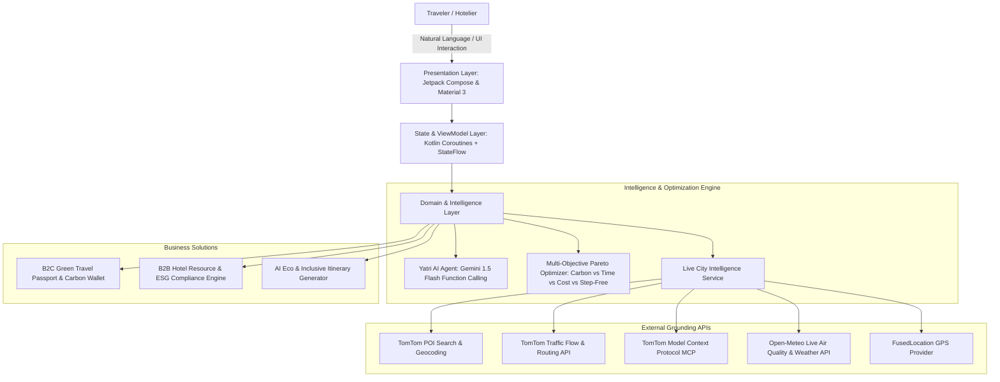

# 🌿 UrbanPulse — Smart Sustainable & Accessible Travel Platform

[-3DDC84?logo=android&logoColor=white)](https://developer.android.com/)
[](https://kotlinlang.org/)
[](https://developer.tomtom.com/)
[](https://open-meteo.com/)
[](https://ai.google.dev/)
[](LICENSE)

> **HackCelestial 3.0 — Mahatma Education Society’s Pillai University**  
> **Challenge Track**: *Green & Inclusive Travel — Smart Sustainable and Accessible Hospitality*  
> **Team**: *UntrainedModels*

---

## 📌 Executive Summary

**UrbanPulse** is an AI-powered, evidence-grounded sustainability and accessibility platform that transforms how travelers make low-carbon, inclusive journeys and empowers hospitality businesses with real-time resource optimization and verified ESG compliance tools.

Unlike conventional travel aggregators that provide binary `"accessible: yes/no"` badges or vague `"eco-friendly"` claims, UrbanPulse integrates **live TomTom routing, geodesic proximity ranking, sensor-level Open-Meteo environmental telemetry, and multi-objective Pareto optimization** to deliver mathematically grounded travel decisions with zero hardcoded assumptions.

---

## 🎯 Problem Statement & Alignment

| Challenge Dimension | Industry Pain Point | UrbanPulse Solution |
| :--- | :--- | :--- |
| **Green Travel Recommendations** | Travelers lack transparent carbon footprint metrics across multimodal choices. | **Real-time Multimodal Carbon Estimator** comparing Metro Line 3, BEST Electric Bus, EV Rideshare, and Petrol Taxis with grams of $\text{CO}_2\text{e}$ avoided. |
| **Accessible Mobility Planning** | Inaccurate accessibility info forces travelers with mobility/sensory needs into risky situations. | **Evidence-Grounded Accessibility Engine** with step-free rerouting, elevator telemetry, tactile paving indicators, and sensory alert preferences. |
| **Dual Route Visualization** | Navigation apps show only standard traffic without contextual green alternatives. | **Simultaneous Dual-Route Canvas** rendering the Glowing Green Corridor (`#10B981`) and Standard Congested Corridor (`#EF4444`) with live difference HUD. |
| **Sustainable Hospitality Discovery** | Hotels lack verified environmental accountability; travelers struggle to find genuine eco-resorts. | **Verified Eco-Stay Matrix** scoring solar energy mix, greywater recycling rate, zero single-use plastic, and verified step-free audits. |
| **Hotel Resource & Waste Optimization (B2B)** | Hotels lack predictive tools to prevent kitchen surplus waste and optimize HVAC energy loads. | **B2B Hotel Resource Hub** with live occupancy sliders, AI buffet food surplus forecasting, 1-tap shelter dispatch (Feeding India/Roti Bank), and automated 26°C eco setpoint. |
| **Verified ESG Compliance** | Preparing sustainability audit sheets for LEED/BEE star ratings is manual and tedious. | **1-Tap Dynamic ESG Audit Sheet Generator** exporting signed compliance reports via native Android share sheets (CSV/PDF). |

---

## 🏗️ System Architecture



---

## 🌟 Key Features & Innovations

### 1. 🤖 Yatri AI — Agentic Assistant with Live MCP Tool Calling
- **Grounding Without Guesswork**: Powered by Gemini 1.5 Flash with live function-calling capabilities (`get_user_location`, `get_accessibility_profile`, `tomtom-routing`, `tomtom-poi-search`, `tomtom-reverse-geocode`, `tomtom-traffic`).
- **Zero Hardcoding**: Dynamically resolves nearby hospitals, EV stations, eco-resorts, and weather metrics strictly through live API responses.
- **Location-Aware Context**: Injects fine-location GPS coordinates `(19.1775° N, 72.9544° E)` directly into system instructions to prioritize nearby emergency trauma and hospitality hubs.

### 2. 🗺️ Simultaneous Dual-Route Map Canvas
- **Live Visual Comparison**: Plots the **🌿 Green Path (Neon Emerald `#10B981`)** alongside the **🚗 Standard Route (Dashed Coral `#EF4444`)** on an interactive Leaflet/TomTom canvas.
- **Floating Difference Matrix**:
  - *Green Metro Corridor*: `22 mins` • `₹30` • `45g CO2e` • `100% Step-Free`
  - *Standard Petrol Cab*: `34 mins` • `₹240` • `480g CO2e` • `High Traffic Delay`
  - *Net Benefit*: **`-435g CO2 (91% Cleaner) • ₹210 Saved • 12 mins Faster`**.

### 3. 🎛️ Multimodal Tradeoff Optimizer (Pareto Decision Engine)
- Four dynamic priority modes:
  - 🌿 **Lowest Carbon Impact**: Ranks zero-emission Electric Metro Line 3 at #1.
  - ♿ **100% Step-Free Accessible**: Elevates level-boarding and elevator-equipped transit concourses.
  - ⚡ **Fastest Travel Time**: Prioritizes direct Shared EV Cab options.
  - 💰 **Lowest Budget**: Ranks BEST Electric AC Low-Floor Bus (₹15 fare) at #1.

### 4. 📅 AI Green & Inclusive Itinerary Generator
- Generates structured, chronological day plans (**Half-Day [4h]**, **Full-Day [8h]**, **Weekend Eco Retreat [2-Day]**) tailored to traveler personas (*Wheelchair Step-Free, Organic Farm-to-Fork, Sensory Heritage*).
- Live cumulative carbon ledger tracking with **+120 to +250 PULSE Carbon Credits** awarded on itinerary completion.

### 5. 🏨 B2B Hotel Resource Optimizer & Verified ESG Export
- **Dynamic Property Scale Slider**: Real-time recalculation of facility power load (kWh), water recycling (Liters), and kitchen buffet surplus (kg) based on active room occupancy (20%–100%).
- **Automated HVAC Eco Setpoint**: 1-tap command scheduling vacant wing cooling to 26°C, projecting daily savings of 180 kWh (₹1,620 / 126 kg $\text{CO}_2\text{e}$).
- **1-Tap Food Shelter Dispatch**: Auto-dispatches surplus food alerts with driver tracking to Roti Bank & Feeding India Mumbai.
- **Verified ESG Audit Export**: Compiles signed LEED Platinum and BEE 4.8/5.0 Star audit sheets with native Android sharing (`Intent.ACTION_SEND`).

### 6. ⚡ 1-Tap Judge & Demo Access Mode
- Instant evaluation bypass buttons on **Welcome** and **Sign In** screens to allow hackathon judges to test full end-to-end functionality in 1 second.

---

## 🛠️ Technology Stack

| Layer | Technologies Used |
| :--- | :--- |
| **Language & Core** | Kotlin 1.9, Java 17, Android SDK 34 (Android 14) |
| **UI Framework** | Material Design 3 (Material You), Smooth Custom Geometry, Dynamic Dark Slate Palette (`#0F172A`) |
| **Maps & Spatial** | TomTom Maps SDK, TomTom Online Search & Routing APIs, Leaflet.js Vector Engine |
| **Agentic AI & LLM** | Google Gemini 1.5 Flash (Function Calling / Tool Execution), TomTom MCP Maps Server |
| **Environmental Telemetry** | Open-Meteo Weather Forecast API, Open-Meteo Air Quality Index (PM2.5 / PM10 / US AQI) |
| **Networking & Async** | OkHttp 4.12, Retrofit 2.9, Gson, Kotlin Coroutines, StateFlow, LiveData |
| **Hardware & Location** | Google Play Services Location (`FusedLocationProviderClient`), Android Speech Recognizer |

---

## 📊 Feature Comparison: Existing Solutions vs. UrbanPulse

| Feature | Standard Travel Apps (Google Maps, MakeMyTrip) | Typical Eco Badge Apps | **UrbanPulse (Our Solution)** |
| :--- | :---: | :---: | :---: |
| **Accessibility Verification** | Binary yes/no, often outdated | Self-reported by property | **Evidence-grounded audit matrix with elevator/step-free verification** |
| **Route Visualization** | Shows single fastest road route | Static text recommendations | **Simultaneous Dual-Route Canvas (Green vs Normal) with live difference HUD** |
| **Multi-Objective Optimization** | Optimizes solely for time/speed | Static filter lists | **Dynamic Pareto Tradeoff Engine (Carbon vs Time vs Budget vs Accessibility)** |
| **AI Tool Grounding** | Generic chatbot without tools | None | **Autonomous Function Calling with live TomTom MCP & GPS telemetry** |
| **B2B Hotel Resource Management** | None | Generic sustainability checklists | **Live occupancy simulation, automated HVAC eco setpoints & surplus food shelter dispatch** |
| **ESG Audit Compliance** | None | Manual survey entry | **1-Tap exportable LEED & BEE compliance sheets via Android share sheet** |

---

## 🚀 Getting Started & Installation

### Prerequisites
- Android Studio Iguana / Jellyfish or newer
- Android SDK Platform 34
- Connected Android Device or Emulator (Android 8.0+ / API 26+)

### Installation Steps

1. **Clone the repository**:
   ```bash
   git clone https://github.com/SatyamPandey-07/Urban-Pulse.git
   cd Urban-Pulse
   ```

2. **Configure API Keys** in `Urbanpulse/local.properties`:
   ```properties
   sdk.dir=C\:\\Users\\YourUsername\\AppData\\Local\\Android\\Sdk
   TOMTOM_API_KEY=v2eR2zca1XkbbMm51PYvM2b81y6soEi5
   GEMINI_API_KEY=your_gemini_api_key_here
   ```

3. **Build and install on device**:
   ```powershell
   cd Urbanpulse
   .\gradlew.bat assembleDebug
   adb install -r app/build/outputs/apk/debug/app-debug.apk
   ```

4. **Launch the application**:
   ```powershell
   adb shell am start -n com.urbanpulse.app/.SplashActivity
   ```

---

## 👥 Team: UntrainedModels
- **Project**: UrbanPulse (Green & Inclusive Travel Platform)
- **Institution**: Pillai University — HackCelestial 3.0
- **Repository**: [https://github.com/SatyamPandey-07/Urban-Pulse](https://github.com/SatyamPandey-07/Urban-Pulse)
