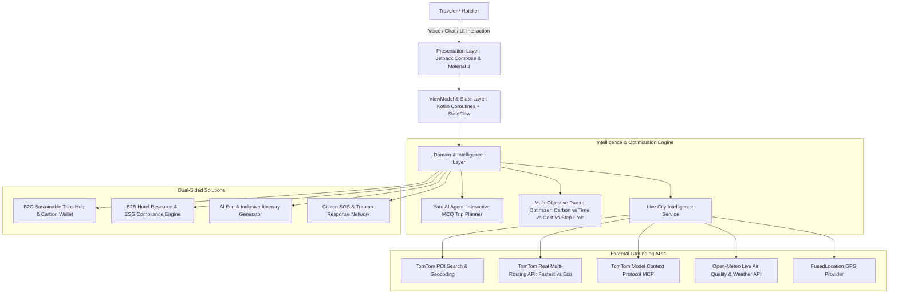

# 🌿 UrbanPulse — Smart Sustainable & Accessible Travel Platform

[-3DDC84?logo=android&logoColor=white)](https://developer.android.com/)

> **HackCelestial 3.0 — Mahatma Education Society’s Pillai University**  
> **Challenge Track**: *Green & Inclusive Travel — Smart Sustainable and Accessible Hospitality*  
> **Team**: *UntrainedModels*  
> **Repository**: [https://github.com/SatyamPandey-07/Urban-Pulse](https://github.com/SatyamPandey-07/Urban-Pulse)  
> **Release Download**: [v1.0.0-hackcelestial](https://github.com/SatyamPandey-07/Urban-Pulse/releases/tag/v1.0.0-hackcelestial)

---

## 📌 Executive Summary

**UrbanPulse** is an AI-powered, evidence-grounded sustainability and accessibility platform that transforms how travelers make low-carbon, inclusive journeys and empowers hospitality businesses with real-time resource optimization and verified ESG compliance tools.

Built natively for Android, UrbanPulse replaces static badges with **live TomTom routing, geodesic proximity ranking, sensor-level Open-Meteo environmental telemetry, and real-time multi-objective Pareto trade-off optimization**—delivering provable carbon avoidance and step-free travel recommendations with zero hardcoded assumptions.

---

## 🌟 What’s New in Latest Release:

1. **🤖 Interactive MCQ Trip Planner in Yatri AI**:
   - Multi-turn conversational trip builder that asks structured MCQ chips right in the chat (e.g., *"How many days?"*, *"Travel Style & Accessibility?"*).
   - Generates complete, rich itineraries with real hotels (e.g., *The Machan Solar Resort*), electric rail transit (*Indrayani Express*), step-free access status, and 1-tap **"Save to My Trips"** / **"View Full Plan"** actions!

2. **🧳 Dedicated Sustainable Trips Hub (Replacing Digital Twin)**:
   - Dedicated **Trips** tab in the main navigation.
   - Live insights into **Upcoming Trips**, **Completed / Carbon Certified Trips**, and **1-Tap AI Getaway Planners** for nearby destinations (*Lonavala*, *Alibaug*, *Mahabaleshwar*, *Matheran*).
   - Full-screen **Trip Detail Activity** with day-by-day timetables, step-free access verification, transit comparisons, and budget breakdowns.

3. **🗺️ Authentic Dual-Route TomTom Engine & Open-Meteo AQI Grounding**:
   - **Real Red Route**: Queries TomTom `calculateRoute` with `routeType=fastest&traffic=true` for actual congested road geometry.
   - **Real Green Route**: Queries TomTom `calculateRoute` with `routeType=eco` for actual low-emission transit corridor geometry.
   - **Real Open-Meteo AQI**: Live localized US AQI and PM2.5 sensor telemetry.
   - **Authentic Maharashtra Fare Formulas**: Standard taxi base ₹28 + ₹18.5/km ($160\text{g CO}_2/\text{km}$) vs. Electric Metro/Rail ₹10-₹45 ($14\text{g CO}_2/\text{km}$).

4. **🏨 B2B Hotel Resource Hub & ESG Compliance Export**:
   - Dynamic facility slider (20% to 100% occupancy) recalculating power load, water recycling, and kitchen buffet surplus in real-time.
   - 1-tap dispatch to local food shelters (*Roti Bank / Feeding India*).
   - 1-tap export of signed LEED Platinum and BEE 4.8/5.0 Star compliance audit sheets.

---

## 🏗️ System Architecture

---

## 🛠️ Technology Stack

| Layer | Technologies Used |
| :--- | :--- |
| **Language & Core** | Kotlin 1.9, Java 17, Android SDK 34 (Android 14) |
| **UI Framework** | Material Design 3 (Material You), Smooth Custom Geometry, Dynamic Dark Slate Palette (`#0F172A`) |
| **Maps & Spatial** | TomTom Maps SDK, TomTom Real Dual-Routing & POI Search APIs, Leaflet.js Vector Engine |
| **Agentic AI & LLM** | Google Gemini 1.5 Flash (Function Calling / Tool Execution), TomTom MCP Maps Server |
| **Environmental Telemetry** | Open-Meteo Weather Forecast API, Open-Meteo Air Quality Index (PM2.5 / PM10 / US AQI) |
| **Networking & Async** | OkHttp 4.12, Retrofit 2.9, Gson, Kotlin Coroutines, StateFlow, LiveData |
| **Hardware & Location** | Google Play Services Location (`FusedLocationProviderClient`), Android Speech Recognizer |

---

## 🚀 Installation & Direct Download

- **Direct Release APK**: Download the pre-built APK from [Releases](https://github.com/SatyamPandey-07/Urban-Pulse/releases/tag/v1.0.0-hackcelestial) or [`release/UrbanPulse-v1.0.0.apk`](https://github.com/SatyamPandey-07/Urban-Pulse/blob/main/release/UrbanPulse-v1.0.0.apk).
- **1-Tap Judge Access**: Instant evaluation bypass button on Welcome and Login screens.

---

## 👥 Team: UntrainedModels
- **Project**: UrbanPulse (Smart Sustainable & Accessible Hospitality Platform)
- **Institution**: Pillai University — HackCelestial 3.0
- **Repository**: [https://github.com/SatyamPandey-07/Urban-Pulse](https://github.com/SatyamPandey-07/Urban-Pulse)
