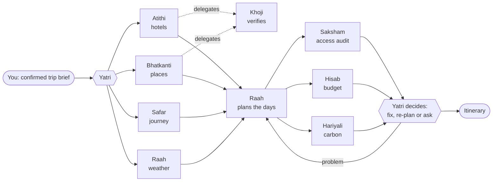

# 🌿 UrbanPulse

### An accessibility-first, sustainability-first travel companion, with nine AI agents that plan a whole trip while you watch.

<div align="center">

[](https://flutter.dev)
[](https://dart.dev)
[](https://groq.com)
[](#-yatri-ai-the-multi-agent-trip-planner)
[](#-quality-and-testing)
[](https://github.com/SatyamPandey-07/Urban-Pulse/releases/tag/v1.0.0-hackcelestial)

**Built for HackCelestial 3.0 (Pillai University) · Track: Local & Experiences**

</div>

---

## Why UrbanPulse

Planning a trip is hard for anyone. It is much harder if you use a wheelchair, are blind or deaf, travel with an elderly parent or a child with sensory needs, or have a tight budget and a conscience about carbon. The information you need is scattered across booking sites, blogs, reviews and maps, and it is rarely honest about the details that matter: *is there a step-free entrance? does the lift actually work? is that price real?*

UrbanPulse does three things about that:

1. **It plans the whole trip for you** (stay, places, journey, days, budget), using a team of specialised AI agents that work in parallel while you watch a live task graph, and that ask you a question only when a choice is genuinely yours.
2. **It never pretends.** Every fact carries its source. Anything a model filled in is labelled *AI-estimated*. Access is "confirmed", "partly" or "unconfirmed", never assumed fine.
3. **It thinks about the whole journey**, for *every* access need in the group (not just wheelchairs) and for the carbon footprint of every choice.

---

## ✨ Yatri AI: the multi-agent trip planner

Yatri is the assistant in the app. It starts as a friendly intake conversation, then hands your confirmed brief to a team of agents.

### 1. The conversation (phase 1)

- Chat-first: type "Family of four from Pune to Munnar, one is in a wheelchair, ₹40,000", or tap through **choice cards**. Yatri prefers options, checkboxes and yes/no over free text.
- One question at a time, mandatory fields first, then a couple of optional ones only if the model thinks they would improve the plan.
- Smart about groups (adults, seniors, children and their ages, women's safety preferences) and about accessibility follow-ups for wheelchair, limited mobility, visual, hearing, elderly care, service animals, sensory or cognitive needs, and other special needs.
- A route map draws itself once origin and destination are known; a review form lets you check everything before planning starts. The whole UI is responsive (phone, tablet, wide screens).

### 2. The agents (phase 2)

**Yatri is the only decision-maker.** Every other agent is a specialist worker: it does its job, reports back with evidence and any problems it can see, and never decides anything for you.

| Agent | Job | How it works |
|---|---|---|
| 🟢 **Yatri** | Plans, allocates tasks, checks reports against gates, resolves conflicts, asks you, assembles the itinerary | Deterministic policy over the workers' reports, so a model outage never stops a plan |
| 🔵 **Atithi** | Finds hotels with live prices and per-need accessibility | Xotelo (TripAdvisor data, live per-OTA totals in ₹, price heatmap), Geoapify, OpenStreetMap, a `web_search` tool loop and TripAdvisor listing pages |
| 🟠 **Bhatkanti** | Finds places worth visiting, about 5 to 6 a day | OpenStreetMap, Geoapify, Wikipedia and web search ("must-see", "new and trending", "local food"), ranked and sized to the trip |
| 🟣 **Hisab** | The budget engine | Deterministic: stay, journey, local travel, entry fees, meals and a buffer, each line marked *live* or *estimate*; offers real savings when over budget |
| 🩷 **Khoji** | Verifies claims and finds guest reviews | `groq/compound` (searches the web itself) first, then Tavily search plus the listing page; brings back 2 to 3 reviews, **lower-rated first**, with source links |
| 🩵 **Saksham** | Audits **every step** of the trip for **every access need** | Rules over map tags, listings, reviews and per-mode profiles; a labelled model reading for gaps, capped at "partly" |
| 🔷 **Raah** | Turns places into practical days | Deterministic: clusters places by geography, reads opening hours, uses the weather forecast, adds meals and local legs |
| 🟡 **Safar** | The journey there and back and local legs | Deterministic: time, cost, CO₂ and access per mode (train, bus, e-bus, shared EV, self-drive EV, cab, flight, metro) |
| 🍃 **Hariyali** | Carbon footprint and eco score | Journey, local travel and stay emissions vs the most polluting comparable choices, plus concrete greener options |


```mermaid
flowchart LR
    U([You: confirmed trip brief]) --> Y{{Yatri}}
    Y --> A[Atithi<br/>hotels]
    Y --> B[Bhatkanti<br/>places]
    Y --> S[Safar<br/>journey]
    Y --> W[Raah<br/>weather]
    A -. delegates .-> K[Khoji<br/>verifies]
    B -. delegates .-> K
    A & B & S & W --> R[Raah<br/>plans the days]
    R --> SK[Saksham<br/>access audit]
    R --> H[Hisab<br/>budget]
    R --> G[Hariyali<br/>carbon]
    SK & H & G --> Y2{{Yatri decides:<br/>fix, re-plan or ask}}
    Y2 -->|problem| R
    Y2 --> I([Itinerary])
```

Watch it happen: the chat shows a **live task graph** (agent-coloured nodes, status glyphs, a "?" on everything explaining *why* an agent did something) and a feed narrating the work ("Yatri allocated the hotel search to Atithi", "Hisab is asking Atithi and Safar for cheaper options"). It expands to a full-screen "mission control" view.

### 3. When Yatri asks you (and only then)

Yatri asks when goals collide, always with concrete options:

- *None of these hotels is confirmed wheelchair accessible. Show the best anyway, or search wider?*
- *The cheapest suitable stay is ₹X a night, above your budget. Raise it, search wider, or keep it?*
- *Classics or newly popular places?*  ·  *Which way to travel* (time, cost, CO₂ and access side by side)?
- *Heavy rain on Saturday with outdoor plans. Move them to drier days?*
- *The plan is ₹Y over budget: a cheaper stay, a cheaper journey, or skip the paid places?*
- *You said the greenest option matters most: the train saves 180 kg CO₂. Switch?*

Minor problems are fixed quietly (an unsuitable minor place is swapped for a better fit, and the feed says so). Questions are asked one at a time, and the time you spend answering is not counted against the 45 to 60 second planning target.

### 4. What you get

A full itinerary screen (also saved to *My Trips* and shareable as a **PDF**):

- **Days**: a map with numbered stops and a timeline (arrival, check-in, visits with opening-hours awareness, meals, local legs with cost and CO₂, access and warning chips)
- **Budget**: the total against your budget, split by category, every line marked live or estimate
- **Access**: an audit of every step for every need, with the source of each reading and a "confirm before you go" list
- **Green**: eco score, footprint breakdown, and greener choices
- **Trip**: the stay (with Khoji's verdicts and review quotes), journey options, a confidence score, everything the plan assumes, every source, and how long each agent worked

### 5. Built not to break

Judges, and travellers, type strange things and networks fail.

- **Real data first; the model only fills gaps, and says so.** No city or trip is hardcoded. The TripAdvisor destination key is validated by distance so a wrong guess can never put Bengaluru hotels in Munnar.
- **Every worker can time out, fail or return partial data** without breaking the plan. Yatri routes around it and tells you.
- **Sanitised input** (control characters, length), **safe links** (only http/https), **offline detection** (an offline estimate, never "unknown place"), **cancellation** (restart the chat and a running plan stops and can never write into the new one).
- **Chaos-tested**: the whole pipeline is run against hostile destinations (emoji, SQL, HTML, prompt injection, a 10,000-character name), random service outages, garbage model replies and random answers.
- **Free-tier friendly**: a per-plan credit budget for paid searches, aggressive caching, shared request de-duplication, and a spread of Groq calls across several keys.

---

## 🧭 The rest of the app

The original UrbanPulse experience is still here, now in Flutter:

| Area | What it does |
|---|---|
| **Local discovery** | Pareto-ranked local experiences that balance carbon, accessibility and price, a 2-hour micro-experience filter near your live location, and one-tap adaptation to rain or delays |
| **Evidence-based accessibility** | Every accessibility and sustainability claim is tagged *Verified / Reported / Inferred*; traveller confirmations and "report an issue" feed it as an independent second source |
| **Live map** | Dual-route comparison (green transit corridor vs petrol cab) with live TomTom routing, CO₂ avoided and a live AQI readout |
| **Provider hub** | Local artisans and guides list experiences, toggle availability and see real demand |
| **Hospitality & ESG** | A B2B tool that forecasts resource use for hotels and exports an ISO 14064-style A4 audit PDF with computed pass/fail and a content hash |
| **Wallet, achievements, SOS** | Carbon wallet, badges and challenges, and an emergency screen |
| **Central Registry** | A small Express + SQLite backend (`server/`) shared by the app and the web app: listings, bookings and traveller reports; the app keeps working offline with a local store |

There is also a **web platform** (`index.html`, `app.js`, Leaflet) that talks to the same registry.

---

## 🏗️ Architecture

```
urbanpulse_flutter/lib/
  core/          theme, palette, build-time config, routes, safe link opening
  models/        plain data classes: trip brief, questions, itinerary (JSON round-trip)
  domain/        pure logic: brief validation, question planning, accessibility rules,
                 opening hours, Pareto ranking, evidence graph, carbon estimation
  services/      network edges: Groq, TomTom, Open-Meteo, Xotelo, Geoapify, Overpass,
                 Wikipedia, the registry, PDF generation
  repositories/  SQLite and preference-backed storage (trips, briefs, itineraries)
  state/         ChangeNotifier controllers (the Yatri controller runs the conversation
                 and the planner)
  agents/
    runtime/     task board (DAG scheduler), live task graph model, plan clock,
                 Groq key ring, lenient JSON, toolkit
    tools/       shared web_search / fetch_page tools + bounded tool-use loop
    receptionist/  the intake agent (phase 1)
    yatri/ atithi/ bhatkanti/ hisab/ khoji/ saksham/ raah/ safar/ hariyali/
  screens/ widgets/  UI: chat, choice cards, task graph, itinerary screen
```

Design rules that hold everywhere:

- **Deterministic core, model at the edges.** Budget, routing, scheduling, gates and carbon are plain code with table-style tests; models extract, rank, estimate and verify, and their output is validated.
- **Provenance on everything.** Values carry where they came from; estimates are always marked.
- **State management** is Flutter's built-in `ChangeNotifier` through one `AppScope`. No state package.

### Data sources

| Source | Used for | Key needed |
|---|---|---|
| [Groq](https://groq.com) (`gpt-oss-120b`, `gpt-oss-20b`, `groq/compound`) | Conversation, agent reasoning, verification with built-in web search | `GROQ_API_KEY` (extra keys optional) |
| [Tavily](https://tavily.com) | The agents' shared web search and page extraction | `TAVILY_API_KEY` (optional) |
| [Geoapify](https://www.geoapify.com) | Hotels and attractions with coordinates and wheelchair tags | `GEOAPIFY_API_KEY` (optional) |
| [Xotelo](https://xotelo.com) | TripAdvisor hotel lists, live per-OTA prices, price heatmap | None (search endpoint optional via RapidAPI) |
| OpenStreetMap (Overpass) | Places, opening hours, access tags | None |
| Wikipedia | Notability and short descriptions | None |
| [Open-Meteo](https://open-meteo.com) | Forecast, seasonal weather history, geocoding, air quality | None |
| [TomTom](https://developer.tomtom.com) | Live map routing, traffic (existing tabs) | `TOMTOM_API_KEY` (optional) |

---

## 🚀 Getting started

### Prerequisites

- Flutter 3.41+ (Dart 3.11)
- Android SDK and a device or emulator (the project is developed against Android; other platforms are generated but less tested)
- Node.js 18+ (only for the shared registry backend and the web app)

### Configure your keys

No key is committed. Copy the example and fill in your own:

```bash
cd urbanpulse_flutter
cp config.example.json config.json      # gitignored
```

| Key | Needed? | What it powers |
|---|---|---|
| `GROQ_API_KEY` | **Yes** for Yatri | Conversation, agents, Khoji's web-search verification |
| `TAVILY_API_KEY` | Recommended | Web search for hotels, places, reviews |
| `GEOAPIFY_API_KEY` | Recommended | Hotels and places with coordinates and wheelchair tags |
| `GROQ_API_KEY_2` … `_4` | Optional | Extra keys so parallel agents do not share one rate limit |
| `TAVILY_API_KEY_2`, `_3` | Optional | More search credits |
| `XOTELO_RAPIDAPI_KEY` | Optional | City to TripAdvisor key lookup (everything else in Xotelo needs no key) |
| `TOMTOM_API_KEY` | Optional | The live map and traffic tabs |
| `CENTRAL_REGISTRY_BASE_URL` | Optional | The shared backend (use your PC's LAN IP on a real phone) |

Keys are baked in at build time, so add them **before** building. Every key is optional in the sense that the app still runs: without a Groq key the Yatri chat is disabled, and without the search keys the planner falls back to OpenStreetMap, Wikipedia and clearly labelled estimates.

### Run on a phone in debug mode (one command)

```bash
./run.sh            # first USB-connected phone; hot reload with r, restart with R
./run.sh <device>   # pick a device from `adb devices`
```

Or by hand:

```bash
cd urbanpulse_flutter
flutter pub get
flutter run --dart-define-from-file=config.json
```

### Optional: the shared backend and the web app

```bash
cd server && npm install && npm start      # http://localhost:3001
# web app: copy config.local.example.js to config.local.js, add keys, then
npx serve .                                 # http://localhost:3000
```

### Try the planner without keys

Open the **Yatri AI** tab, tap ⋮ and choose **Preview agent graph (demo)** to watch the full agent graph run offline with scripted data.

---

## ✅ Quality and testing

```bash
cd urbanpulse_flutter
flutter analyze
flutter test        # 424 tests
```

The suite includes table-driven tests for the deterministic engines (validation, question planning, accessibility rules, opening hours, day planning, budgets, gates), orchestration tests with scripted models and fake services, widget tests for the chat, hotel cards, task graph and itinerary screen at phone, tablet and desktop sizes in light and dark, and **chaos tests** that run the whole planning pipeline against hostile inputs and random failures.

CI (`.github/workflows/flutter-ci-cd.yml`) builds the Android APK on pushes to `main`.

### An honest status note

Everything above is verified with tests, mocks and a debug build. The planner has **not yet been run end to end against live Groq, Tavily and Geoapify or measured against its 45 to 60 second target on a device**; that is the next thing to do once keys are in. Prices and times shown as estimates are estimates, and the app says so.

---

## 📂 Repository map

| Path | What is in it |
|---|---|
| [`urbanpulse_flutter/`](urbanpulse_flutter) | The Flutter app (primary client). Its [README](urbanpulse_flutter/README.md) has the screen map and dependency notes |
| [`server/`](server) | The Central Registry backend (Express + SQLite) |
| `index.html`, `app.js`, `style.css` | The web platform |
| [`FEATURES.md`](FEATURES.md) | Additional implemented features (e.g. the real-time impact dashboard) |
| [`ppt.md`](ppt.md) | The hackathon pitch deck outline |
| [`release/`](release) | The v1.0.0 Android APK |
| `run.sh` | One-command debug run on a USB phone |

---

<div align="center">
  <sub>Made for HackCelestial 3.0 · <a href="https://github.com/SatyamPandey-07/Urban-Pulse">github.com/SatyamPandey-07/Urban-Pulse</a></sub>
</div>
